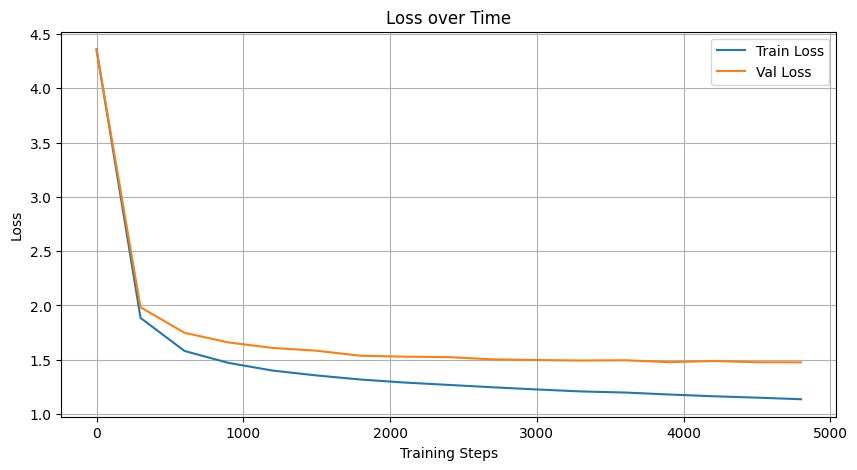

# GPT-Like Transformer Language Model with Custom Tokenizer

This project implements a Transformer-based language model inspired by GPT, written from scratch in PyTorch. It also includes a custom Byte Pair Encoding (BPE)-like tokenizer for processing raw text.

## Model Training Loss

The plot below illustrates the decrease in training loss over 5000 epochs. We can see that the loss steadily decreases, indicating the model is learning effectively.


## 📌 Features

- Transformer architecture with:
  - Multi-head self-attention
  - Layer normalization
  - Residual connections
  - Feed-forward network
  - Dropouts 
- Custom tokenizer using regex-based token splitting and byte-level BPE
- Text generation from a trained model
- Character-level encoding and decoding fallback
- Lightweight and educational code

## 📁 File Structure

- `input.txt`: Training data (tiny shakespeare text).
- `bygram.py`: Complete implementation of the language model and training loop.
- `Token.py`: Complete implementation of the Tokenizer with include byte-pair-encoding.


## ⚙️ Hyperparameters

```python
batch_size = 64
block_size = 256
n_embd = 384
n_head = 6
n_block = 6
dropout = 0.2
learning_rate = 1e-3
max_iters = 5000
eval_interval = 300
```

## 🧠 Model Architecture
```bash
Embedding Layer: Token and positional embeddings

Transformer Blocks: 6 blocks each containing:

    - Multi-head attention (6 heads)

    - LayerNorm + residuals

    - Feed-forward network

Output Layer: Linear projection to vocabulary size
```

##  🧪 Tokenizer
The Tokenizer class builds a vocabulary using byte-level encoding and a simplified BPE training loop.Which also include regex-based token splitting for efficient text processing and prevents the model from merging specific words. 

Tokenization Example:
```python
    # Copy Token 
    tokenizer = BasicTokenizer()
    tokenizer.train(text, vocab_size=300)

    encoded = tokenizer.encode("Hello world!")
    decoded = tokenizer.decode(encoded)

    print("Encoded:", encoded)
    print("Decoded:", decoded)
```
##  🚀 Training
Make sure you have an input.txt file in the working directory with sufficient text data.

Run training with:

```Python
    #Copy bygram.py
    # then Run the training script
    The model will periodically print training and validation loss.
```

## ✍️ Text Generation
After training, the model can generate text:

```python
# At the end of bygram.py, after training
context = torch.zeros((1, 1), dtype=torch.long)
print(decode(model.generate(context, max_new_tokens=500)[0].tolist()))
```
## 📦 Requirements

- Python 3.8+

- PyTorch

- regex library

- matplotlib (for plotting loss)


📜 License
This project is open-source and free to use for educational purposes.

